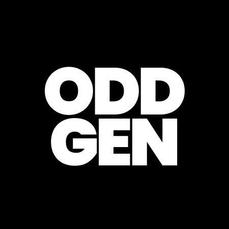

# ODDGen - Object Detection Dataset Generator
### Generate object detection datasets from individual objects with automatic bounding box annotations

<br>
  <div align="center">
    
  </div>
<br>

## Features
- Automatically generates object detection dataset along with bounding box annotations
- Background remover for objects with backgrounds along with training script for U2NET if one requires a custom background remover
- Add backgrounds to generated images
- Easily scalable to generate tens of thousands of images through batching

## Installation
```bash
git clone https://github.com/pranftw/oddgen.git
cd oddgen
# create and activate virtual environment
pip install -r requirements.txt
```

## Example
<br>
  <div align="center">
    
  </div>
<br>

- A simple ShapeNet example is demonstrated in `example.py`
- Download sample dataset from https://drive.google.com/drive/folders/1mGMq5jGSY_BmnOdYjejDg_yi8zeSmOc2?usp=sharing and sample backgrounds from https://drive.google.com/drive/folders/135ozo_lTppYSaquCMWP566fEpl0MyWff?usp=sharing
- The sample dataset contains 3 objects - phone, ship and plane from ShapeNet. Sample backgrounds contains several background images
- Set the required path environment variables as specified in SET ENV VARS
- Execute `python example.py` by uncommenting only the required functions one by one


## Download PyTorch files for Background Remover
- `mkdir oddgen/bg_remover/models`
- Download the required files from the following links into `oddgen/bg_remover/models`
  - model scripts - https://drive.google.com/drive/folders/1CckJQwVC2gRu9xw0HNNw5JYhC4RHfMHQ?usp=sharing
  - ISNET weights - https://drive.google.com/file/d/1nV57qKuy--d5u1yvkng9aXW1KS4sOpOi/view?usp=sharing
  - U2NET weights - https://drive.google.com/file/d/1ao1ovG1Qtx4b7EoskHXmi2E9rp5CHLcZ/view?usp=sharing
  - U2NETP weights - https://drive.google.com/file/d/1rbSTGKAE-MTxBYHd-51l2hMOQPT_7EPy/view?usp=sharing
